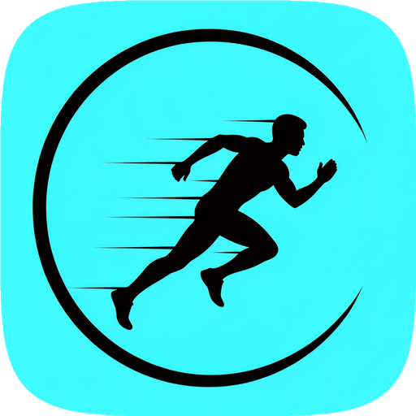

# RunCraft



iOS training planner for serious runners following Jack Daniels' VDOT
methodology. RunCraft turns a single race goal into a 16-week periodised
plan and dispatches structured workouts to Apple Watch via WorkoutKit —
all reachable by voice through Siri and Apple Intelligence.

> **Status:** active development. Not yet shipped to the App Store.
> iPhone-only — the paired Apple Watch is driven through `WorkoutScheduler`
> rather than a companion app.

## What it does

- **VDOT-driven 16-week plan.** Pick a race date and distance; RunCraft
  generates 16 periodised weeks (base → build → peak → taper) with daily
  sessions, each tagged with a target pace zone derived from your VDOT.
- **One-tap workout dispatch.** Today's session card on the Plan tab has
  a play button — taps schedule a `WorkoutPlan` for the paired Apple
  Watch, which surfaces it in the native Workout app.
- **Voice-first control.** Four App Intents drive Siri / Spotlight /
  Apple Intelligence:
  - "What's today's training in RunCraft" — reads the session out loud
  - "Start Mona Fartlek in RunCraft" — dispatches the template to your Watch
  - "Set my VDOT to 52 in RunCraft" — manual recalibration
  - "Log a run in RunCraft" — conversational entry for off-Watch runs
- **HRV-aware recovery.** When morning HRV or sleep falls below threshold,
  the Plan tab surfaces a banner suggesting a downgrade for today's hard
  session.
- **Insights.** Fitness-trend card with a segmented picker (VDOT /
  VO₂max / Δ), weekly mileage bar chart, and predicted race times for
  5K / 10K / HM / Marathon.
- **Workout authoring.** Custom workouts (warmup + repeat groups +
  cooldown) plus six built-in presets — Yasso 800s, Mona Fartlek,
  Cruise Intervals, Ladder, Tempo Run, Easy Recovery.

## Tech stack

| Layer        | Tool                                          |
| ------------ | --------------------------------------------- |
| Language     | Swift 6                                       |
| UI           | SwiftUI                                       |
| Architecture | The Composable Architecture (TCA) 1.25+       |
| Persistence  | SQLiteData (pfw)                              |
| Apple I/O    | HealthKit · WorkoutKit · App Intents          |
| Min versions | iOS 17 · iPadOS 17 · watchOS 10               |

## Building

Requires Xcode 16+ on macOS 14+.

```sh
git clone https://github.com/<your-user>/RunCraft.git
cd RunCraft
open RunCraftWorkspace.xcworkspace
```

Or from the command line:

```sh
xcodebuild -workspace RunCraftWorkspace.xcworkspace \
  -scheme RunCraft \
  -destination 'platform=iOS Simulator,name=iPhone 17' \
  build
```

The codebase is mostly a local SPM package (`RunCraftPackage/`); the
Xcode project (`RunCraft.xcodeproj`) is a thin shell carrying the
entitlements, `Info.plist`, and `@main` entry point.

## Layout

```
RunCraft/                          App target (Info.plist, entitlements, AppShortcutsProvider)
RunCraft.xcodeproj/
RunCraftWorkspace.xcworkspace/
RunCraftPackage/                   Local SPM package — the bulk of the code
└── Sources/
    ├── VDOTEngine/                Jack Daniels formula + pace zones (pure Swift)
    ├── RunCraftModels/            SQLiteData @Table types + migration
    ├── HealthKitClient/           TCA dep wrapping HKHealthStore
    ├── AppleWatchSync/            TCA dep wrapping WorkoutKit
    ├── DesignSystem/              Color tokens + WorkoutCard
    ├── TrainingPlanFeature/       Plan tab
    ├── WorkshopFeature/           Workouts tab (history: was "Workshop")
    ├── InsightsFeature/           Insights tab
    ├── AppFeature/                Root reducer + Settings
    └── RunCraftIntents/           App Intents for Siri / Spotlight
```

## Further reading

- [`ARCHITECTURE.md`](ARCHITECTURE.md) — module topology, TCA composition,
  data-flow walk-throughs.
- [`DESIGN_SYSTEM.md`](DESIGN_SYSTEM.md) — colour tokens, typography,
  layout rules, anti-patterns.
- [`UBIQUITOUS_LANGUAGE.md`](UBIQUITOUS_LANGUAGE.md) — domain glossary
  (Order/Customer/Workout/PaceZone disambiguation).
- [`TRAINING_PLAN_FLEXIBILITY.md`](TRAINING_PLAN_FLEXIBILITY.md) —
  how `TrainingPlanGenerator` places sessions once a runner restricts
  `availableDays` / `longRunDay`, and the 1-vs-2-day maintenance-mode
  threshold.
- [`TODOS.md`](TODOS.md) — deliberately-deferred work and the reasoning
  behind each deferral.

## License

RunCraft is released under the **GNU Affero General Public License v3.0**
(AGPL-3.0). See [`LICENSE`](LICENSE) for the full text.

The short version: you can use, copy, and modify the source for any
purpose, but any **derivative work distributed publicly — including a
network-accessible service — must be released under AGPL-3.0 with full
source available.** This prevents closed-source forks of RunCraft from
competing on the App Store.

Copyright © 2026 Cheng Lung Lin.
